# Práctica 2 - Uso de .gitignore y .gitignore_global

## .gitignore Global

Primero creé el archivo `.gitignore_global` en mi carpeta personal

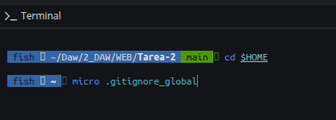

Añadí estas reglas:

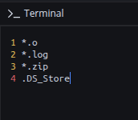

Para comprobar que Git estaba usando el archivo ejecuté `git config --get core.excludesfile`

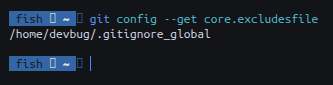

Después creé estos archivos para probar las reglas:

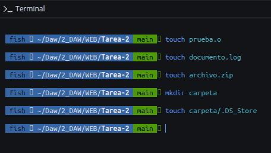

Al hacer `git status` no aparecieron, por lo que estaban siendo ignorados

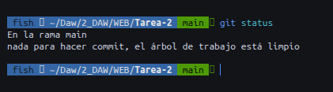

También utilicé `git status --ignored` para comprobar que Git los tenía como archivos ignorados

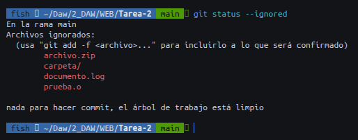

---

## .gitignore local

Después creé el `.gitignore` dentro del repositorio con estas reglas:

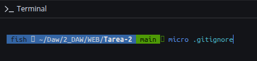

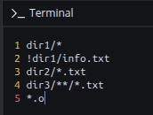

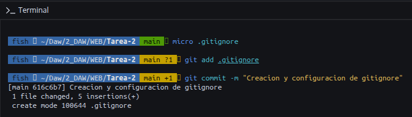

### dir1

Dentro de `dir1` creé:

- `archivo.txt`
- `programa.py`
- `info.txt`

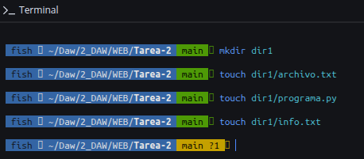

La regla `dir1/*` hace que se ignore todo lo que hay dentro de `dir1`

Con `!dir1/info.txt` hice una excepción para que `info.txt` no se ignorase

Al hacer `git status` apareció `dir1/info.txt`, pero no aparecieron `archivo.txt` ni `programa.py`

### dir2

Dentro de `dir2` creé:

- `test.txt`
- `otros.py`

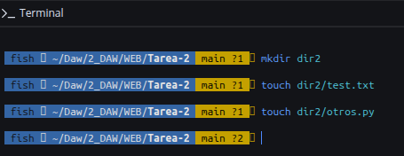

Con la regla `dir2/*.txt` se ignoran los archivos `.txt` de esa carpeta

Por eso `test.txt` no apareció en `git status`, pero `otros.py` sí

### dir3

Creé:

- `dir3/test1.txt`
- `dir3/subdir/test2.txt`

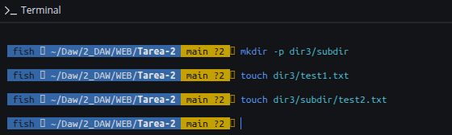

Con la regla `dir3/**/*.txt` se ignoran los archivos `.txt` de `dir3` y de sus subcarpetas

Los dos archivos quedaron ignorados

### Archivos .o

La regla `*.o` hace que los archivos terminados en `.o` sean ignorados

Lo comprobé con `prueba.o`

---

## Resultado de las pruebas

| Archivo | Resultado |
|:---|:---|
| `prueba.o` | Ignorado |
| `documento.log` | Ignorado |
| `archivo.zip` | Ignorado |
| `carpeta/.DS_Store` | Ignorado |
| `dir1/archivo.txt` | Ignorado |
| `dir1/programa.py` | Ignorado |
| `dir1/info.txt` | Permitido |
| `dir2/test.txt` | Ignorado |
| `dir2/otros.py` | Permitido |
| `dir3/test1.txt` | Ignorado |
| `dir3/subdir/test2.txt` | Ignorado |

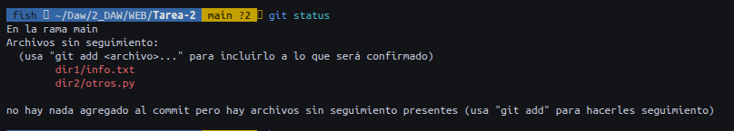

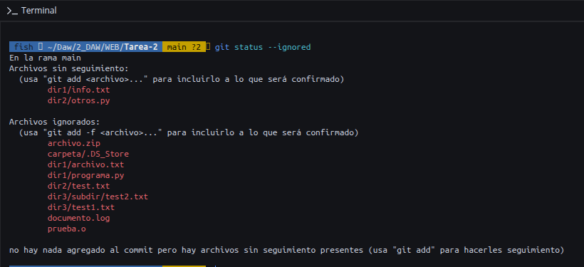

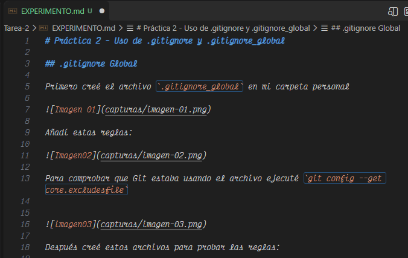

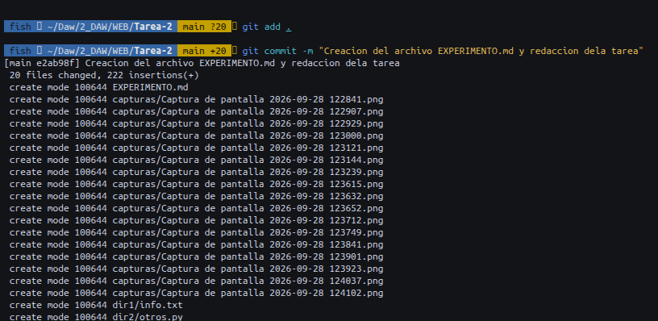

---

## Diferencias entre .gitignore y .gitignore_global

El `.gitignore_global` sirve para poner reglas que se aplican a todos los repositorios

El `.gitignore` local solo afecta al repositorio en el que está creado

En esta práctica lo he usado para las reglas de `dir1`, `dir2` y `dir3`

La diferencia principal es que el global lo puedo usar para archivos que normalmente no quiero subir en ningún proyecto, mientras que el local lo uso para reglas concretas de cada repositorio

## Commit y push

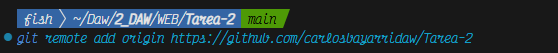
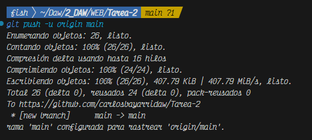
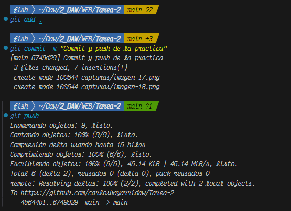

